# Patient Booking App

## Requirements
- riverpod: for managing states
- flutter_riverpod
- hive: database for persistence
- hive_flutter
- uuid: unique identifiers
- intl: date and number formatting
- flutter_local_notifications: allows the app to display alerts
- carousel_slider: for the onboarding screen
- timezone: used to schedule notifications at a certain time (1 hour before appointment)

## How To Run

```
git clone https://github.com/lasersig/appointmentapp.git
flutter pub get
flutter pub run build_runner build        # these files are already generated
flutter run
```

## Video Demo

<iframe width="560" height="315" src="https://youtu.be/Bb5U6teBWFM" frameborder="0" allow="accelerometer; autoplay; clipboard-write; encrypted-media; gyroscope; picture-in-picture" allowfullscreen></iframe>

## Flows

### Splash Screen
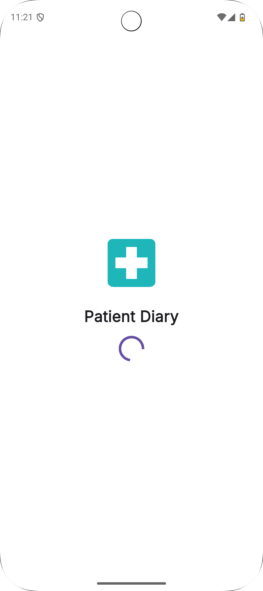
### Onboarding(1, 2, 3)
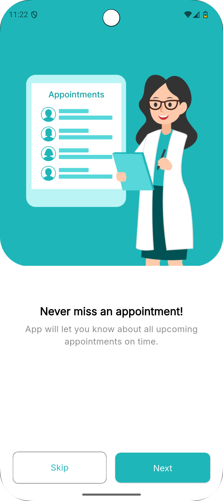
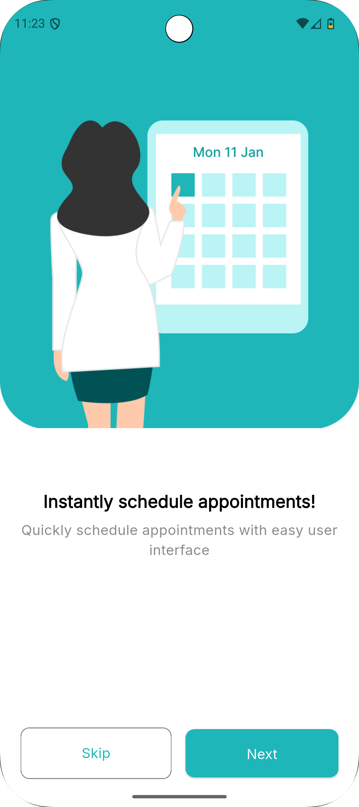

### Sign In
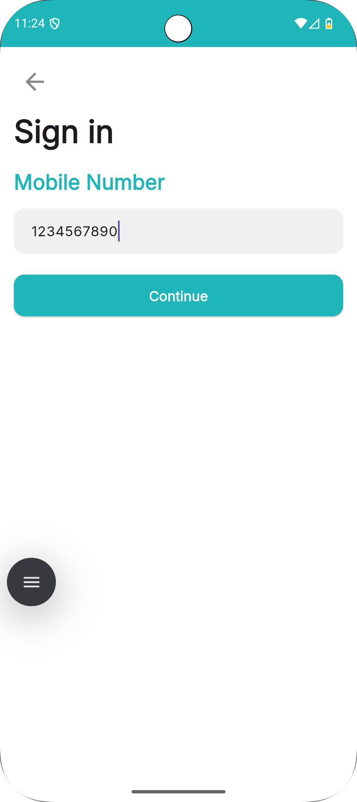
### OTP

### Complete Profile (Optional)
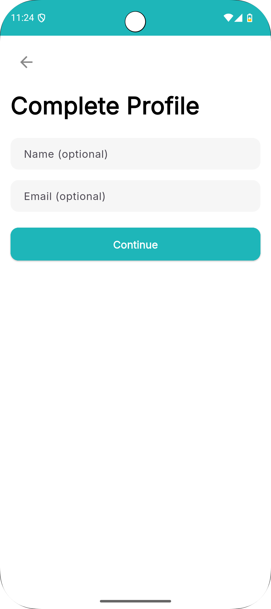
### Upcoming Appointments
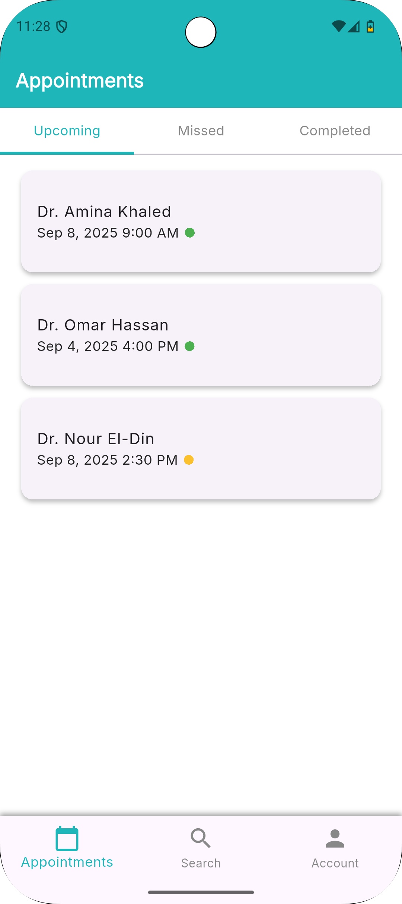
### Missed Appointments
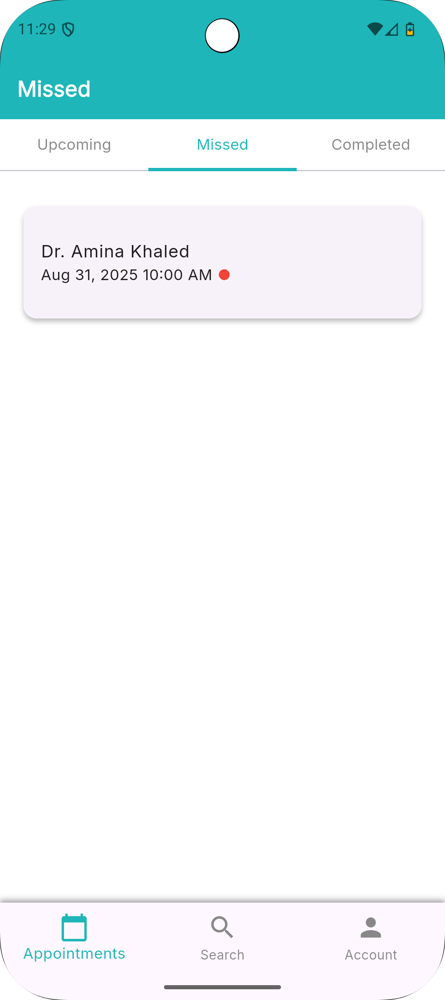
### Completed Appointments
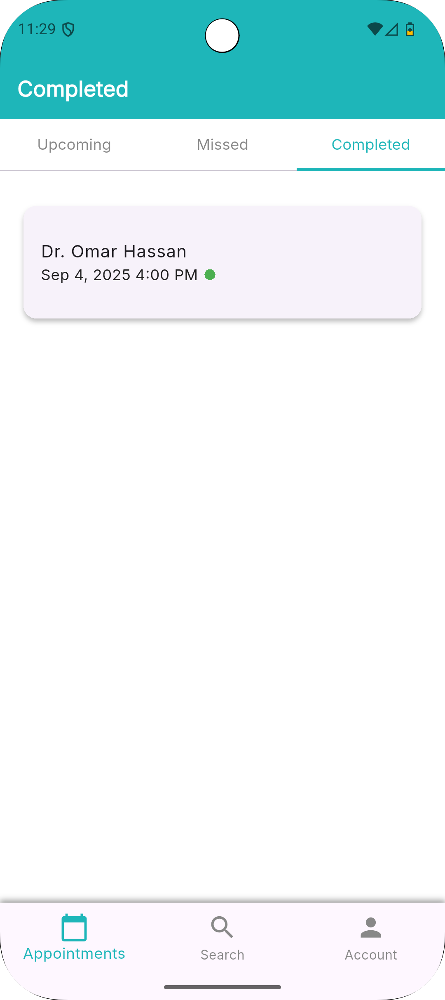
### Search Doctors
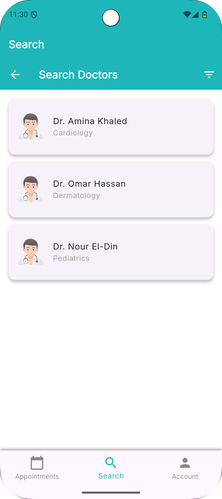
### Filters
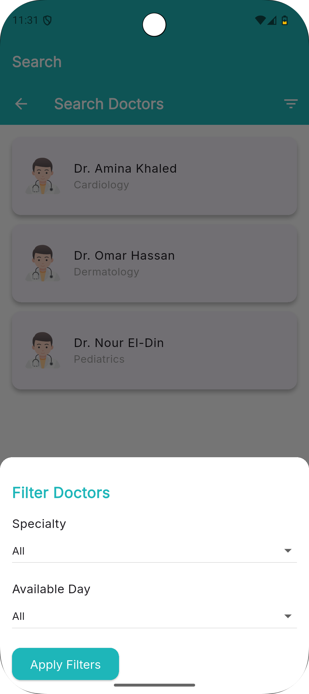
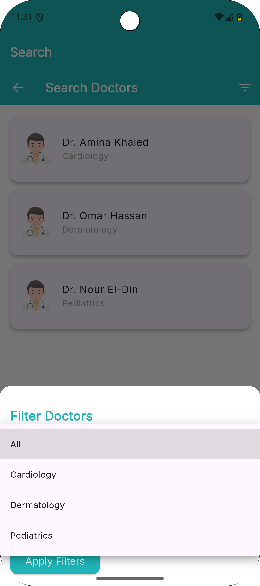
### Doctor Profile After Selecting a Doctor

### Select Date and Time For Appointment (cannot book past dates)
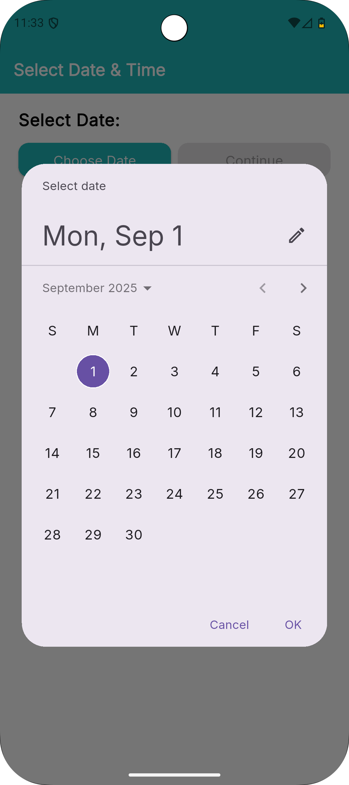
### Select Time Slot
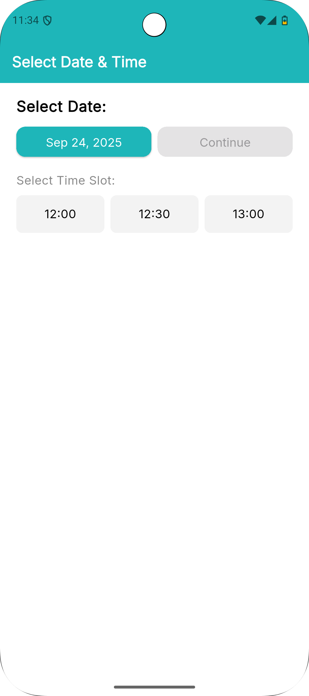
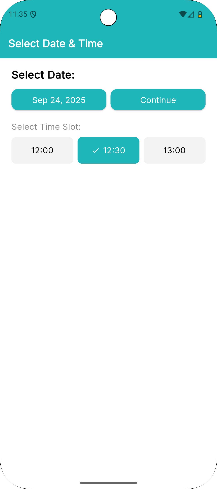
### Confirm Booking
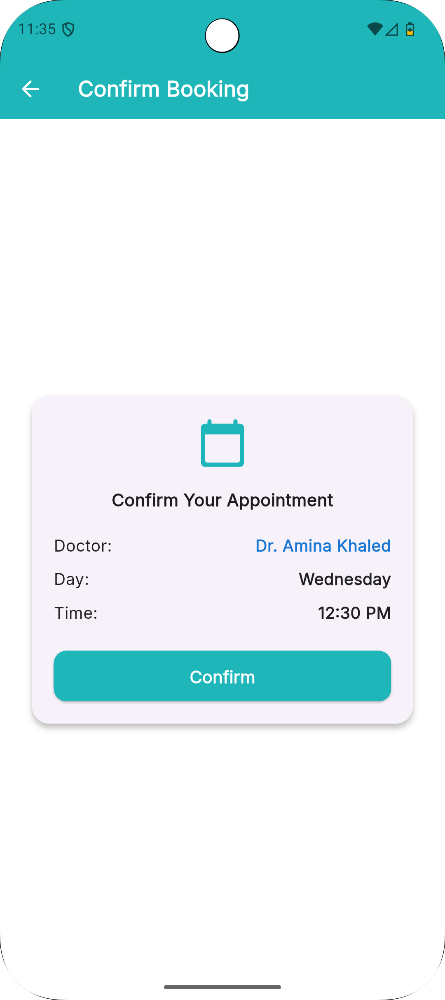
### Notification
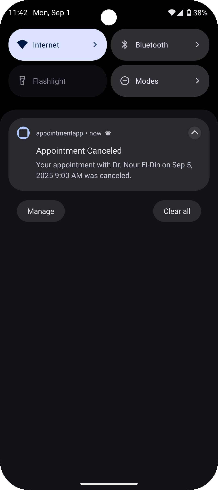
### Appointment Details
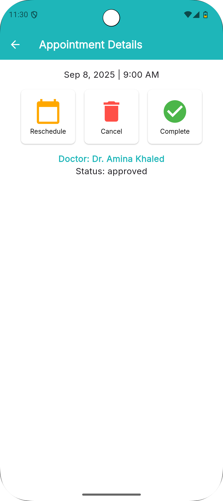
### Confirm Reschedule
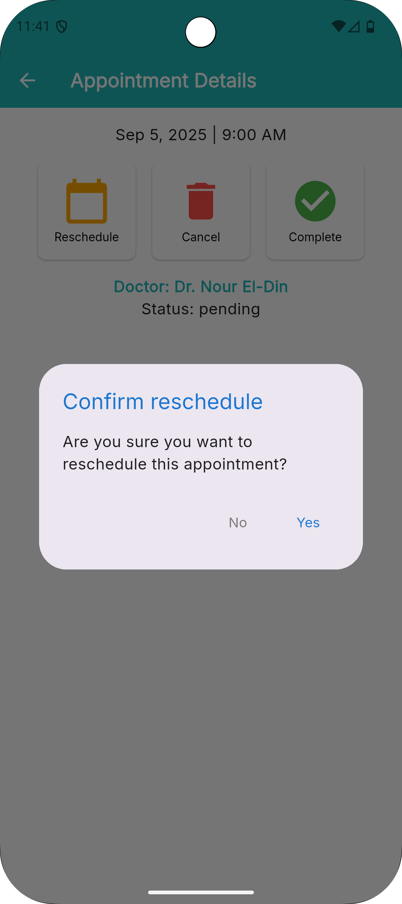
### Confirm Cancel
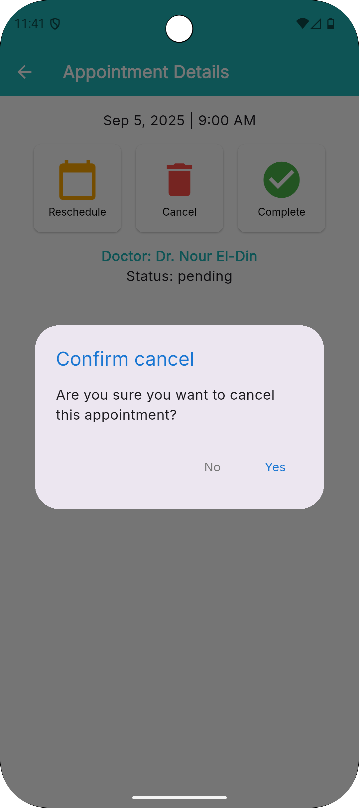
### Account Screen
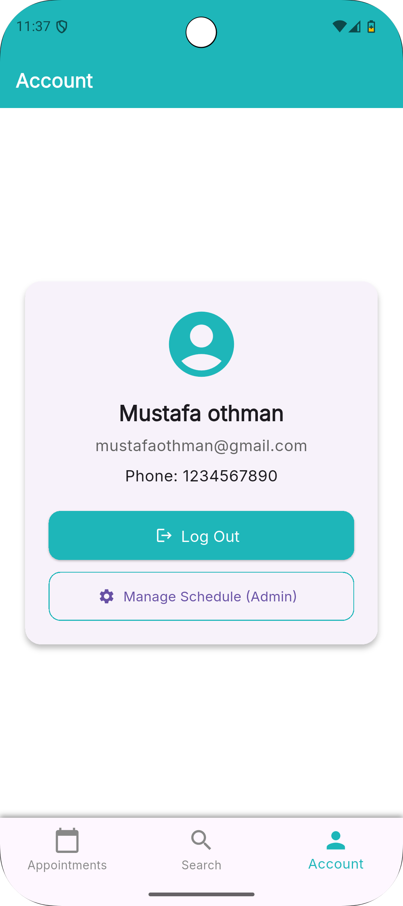
### Sign In As Doctor

### Manage Schedule Button From Account Screen
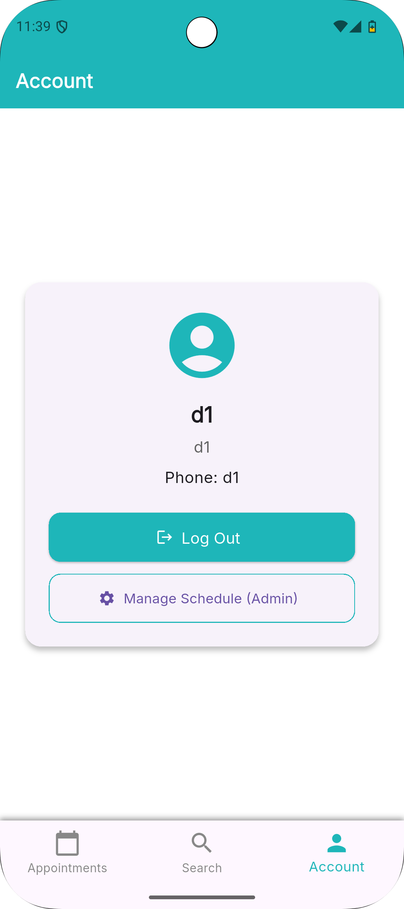
### Simple Doctor Dashboard
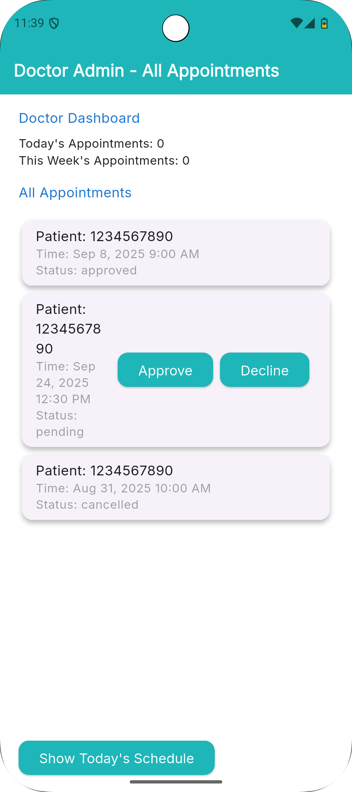
